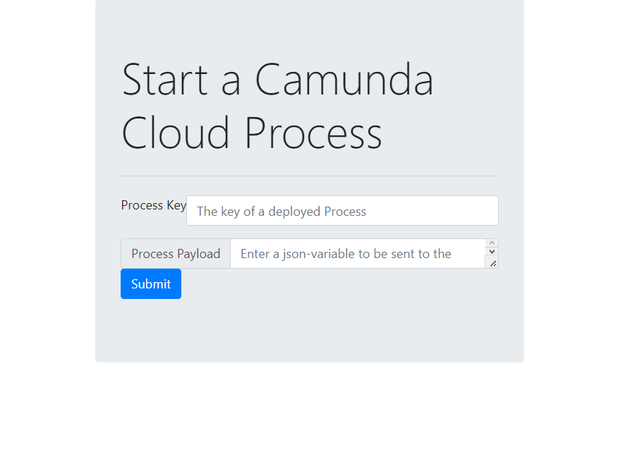

# Camunda Cloud Visual Starter

Just a simple project that lets your start a process instance with some variabes on Camunda Cloud from the safety of your own local hardware.

## How to Configure

1. Add your Camunda Cloud API details to the `application.yaml` file. Follow our guidance on [getting the API details](https://docs.camunda.io/docs/guides/getting-started/setup-client-connection-credentials/) for assistance.
1. Save your updated `application.yml` file.
1. Start up the application by running the `application` class. In this case, you can likely right-click `Application.java` and select **Run Java**.

## Deploy Test Process (Optional)
If you'd like to test this out your can deploy the simple test model that you'll find in `bpmn/TestProcess.bpmn`.


Take the following steps to deploy this process:

1. Log in to your Camunda Cloud account.
1. Click the **Diagrams** tab.
1. Click **Create New Diagram**.
1. Next to the **New Diagram**, select the three vertical dots and click **Import New Diagram** to upload the model referenced above.
1. Select the `TestProcess` process
1. Click **Deploy** on the top right side of the page.

Now you've deployed your process and you can use this app to start is.

## How to Start a process instance

You can go to `http://localhost:8082` to find this lovely little front end


You just need to add the Key of your process (if you deployed the test process this is `TestProcess`)

You can also add some variables if you like, in the following format:
```json
{
  "name": "Thomas",
  "email": "thomas.heinrichs@camunda.com",
  "mobilenumbers": [
    "00412345678900",
    "00412345678901"
  ],
  "fireService_over": "false"
}
```

## Thanks!

Thanks to Thomas for implementing the JSON payload for variables. 
